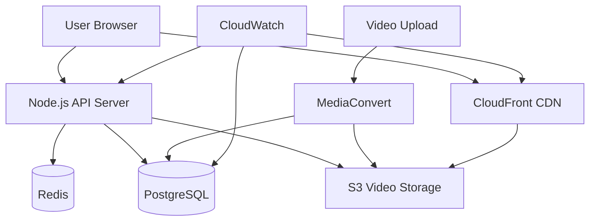

# M1 Video Streaming - Implementation Plan

## Document Information
- **Feature**: M1 - Core Video Streaming Infrastructure
- **Based on**: PRD-M1-Video-Streaming.md
- **Purpose**: Technical implementation guide and development roadmap
- **Timeline**: 16 weeks (4 phases)
- **Status**: Ready for Implementation

---

## Technical Architecture Overview

### Technology Stack

#### Frontend Stack
```javascript
Core Technologies:
- React 18 with TypeScript
- Vite for build tooling
- Tailwind CSS for styling
- React Query for state management
- Video.js or custom HTML5 player
- HLS.js for adaptive streaming

Dependencies:
- @types/react
- react-query
- video.js / hls.js
- tailwindcss
- axios for API calls
```

#### Backend Stack
```javascript
Core Technologies:
- Node.js 18+ with Express
- TypeScript for type safety
- PostgreSQL for metadata
- Redis for caching and sessions
- AWS SDK for cloud services
- FFmpeg for video processing

Dependencies:
- express
- @types/node
- pg (PostgreSQL driver)
- ioredis
- aws-sdk
- multer for file uploads
```

#### Infrastructure & Cloud Services
```yaml
AWS Services:
- S3: Video storage and static assets
- CloudFront: Global CDN distribution
- Elemental MediaConvert: Video encoding
- RDS: PostgreSQL database
- ElastiCache: Redis caching
- CloudWatch: Monitoring and logs

Alternative Options:
- Azure Media Services
- Google Cloud Video AI
- Cloudflare Stream
```

### System Architecture Diagram



---

## Database Schema Design

### Core Tables

```sql
-- Video metadata table
CREATE TABLE videos (
    id UUID PRIMARY KEY DEFAULT gen_random_uuid(),
    title VARCHAR(255) NOT NULL,
    description TEXT,
    duration_seconds INTEGER,
    file_size_bytes BIGINT,
    upload_status video_upload_status DEFAULT 'processing',
    thumbnail_url VARCHAR(500),
    created_at TIMESTAMP DEFAULT NOW(),
    updated_at TIMESTAMP DEFAULT NOW(),
    created_by UUID, -- Reference to users table
    
    -- Video file information
    original_filename VARCHAR(255),
    content_type VARCHAR(100),
    
    -- SEO and metadata
    slug VARCHAR(255) UNIQUE,
    tags TEXT[],
    category VARCHAR(100),
    
    -- Status and visibility
    is_published BOOLEAN DEFAULT false,
    is_public BOOLEAN DEFAULT true
);

-- Video quality variants table
CREATE TABLE video_qualities (
    id UUID PRIMARY KEY DEFAULT gen_random_uuid(),
    video_id UUID REFERENCES videos(id) ON DELETE CASCADE,
    quality_label VARCHAR(10) NOT NULL, -- '360p', '720p', '1080p'
    resolution_width INTEGER,
    resolution_height INTEGER,
    bitrate_kbps INTEGER,
    file_url VARCHAR(500),
    file_size_bytes BIGINT,
    processing_status video_processing_status DEFAULT 'pending',
    created_at TIMESTAMP DEFAULT NOW()
);

-- User video progress tracking
CREATE TABLE video_progress (
    id UUID PRIMARY KEY DEFAULT gen_random_uuid(),
    user_id UUID NOT NULL, -- Reference to users table
    video_id UUID REFERENCES videos(id) ON DELETE CASCADE,
    current_time_seconds DECIMAL(10,2) DEFAULT 0,
    completed_percentage DECIMAL(5,2) DEFAULT 0,
    is_completed BOOLEAN DEFAULT false,
    last_watched_at TIMESTAMP DEFAULT NOW(),
    watch_count INTEGER DEFAULT 1,
    
    UNIQUE(user_id, video_id)
);

-- Video chapters/sections table
CREATE TABLE video_chapters (
    id UUID PRIMARY KEY DEFAULT gen_random_uuid(),
    video_id UUID REFERENCES videos(id) ON DELETE CASCADE,
    title VARCHAR(255) NOT NULL,
    start_time_seconds DECIMAL(10,2),
    end_time_seconds DECIMAL(10,2),
    chapter_order INTEGER,
    description TEXT,
    created_at TIMESTAMP DEFAULT NOW()
);

-- Video streaming analytics
CREATE TABLE video_analytics (
    id UUID PRIMARY KEY DEFAULT gen_random_uuid(),
    video_id UUID REFERENCES videos(id) ON DELETE CASCADE,
    user_id UUID, -- Can be null for anonymous users
    session_id VARCHAR(100),
    
    -- Streaming metrics
    quality_selected VARCHAR(10),
    bandwidth_kbps INTEGER,
    buffer_events INTEGER DEFAULT 0,
    seek_events INTEGER DEFAULT 0,
    quality_switches INTEGER DEFAULT 0,
    
    -- Session information
    device_type VARCHAR(50),
    browser VARCHAR(50),
    os VARCHAR(50),
    ip_address INET,
    country_code VARCHAR(2),
    
    -- Timing metrics
    load_time_ms INTEGER,
    watch_time_seconds DECIMAL(10,2),
    session_start TIMESTAMP DEFAULT NOW(),
    session_end TIMESTAMP
);

-- Custom types
CREATE TYPE video_upload_status AS ENUM (
    'uploading', 'processing', 'ready', 'failed', 'deleted'
);

CREATE TYPE video_processing_status AS ENUM (
    'pending', 'processing', 'completed', 'failed'
);

-- Indexes for performance
CREATE INDEX idx_videos_status ON videos(upload_status, is_published);
CREATE INDEX idx_videos_category ON videos(category);
CREATE INDEX idx_videos_created_at ON videos(created_at DESC);
CREATE INDEX idx_video_progress_user ON video_progress(user_id);
CREATE INDEX idx_video_progress_video ON video_progress(video_id);
CREATE INDEX idx_video_analytics_video ON video_analytics(video_id);
CREATE INDEX idx_video_analytics_session ON video_analytics(session_start DESC);
```

---

## API Design Specification

### Core Video Endpoints

```typescript
// Video streaming and metadata endpoints
interface VideoAPI {
  // Get video metadata and streaming URLs
  GET: {
    '/api/v1/videos/:videoId': VideoDetailResponse;
    '/api/v1/videos/:videoId/qualities': VideoQualitiesResponse;
    '/api/v1/videos/:videoId/stream': VideoStreamResponse;
    '/api/v1/videos/:videoId/progress': VideoProgressResponse;
    '/api/v1/videos/:videoId/chapters': VideoChaptersResponse;
    '/api/v1/videos/:videoId/analytics': VideoAnalyticsResponse;
  };
  
  // Video progress and user interactions
  POST: {
    '/api/v1/videos/:videoId/progress': UpdateProgressRequest;
    '/api/v1/videos/:videoId/analytics': RecordAnalyticsRequest;
    '/api/v1/videos/upload': VideoUploadRequest;
  };
  
  // Admin and management endpoints
  PUT: {
    '/api/v1/videos/:videoId': UpdateVideoRequest;
    '/api/v1/videos/:videoId/publish': PublishVideoRequest;
  };
  
  DELETE: {
    '/api/v1/videos/:videoId': DeleteVideoRequest;
  };
}

// Response type definitions
interface VideoDetailResponse {
  id: string;
  title: string;
  description: string;
  duration: number;
  thumbnail_url: string;
  qualities: VideoQuality[];
  chapters?: VideoChapter[];
  progress?: VideoProgress;
  analytics?: VideoAnalyticsSummary;
}

interface VideoStreamResponse {
  stream_url: string;
  qualities: VideoQualityOption[];
  token: string; // Temporary access token
  expires_at: string;
}

interface VideoProgressResponse {
  current_time: number;
  completed_percentage: number;
  is_completed: boolean;
  last_watched_at: string;
  watch_count: number;
}
```

### API Implementation Examples

```typescript
// Express.js route implementations
import express from 'express';
import { VideoService } from '../services/VideoService';
import { AnalyticsService } from '../services/AnalyticsService';

const router = express.Router();

// Get video streaming information
router.get('/videos/:videoId/stream', async (req, res) => {
  try {
    const { videoId } = req.params;
    const { quality } = req.query;
    const userId = req.user?.id;
    
    // Validate video exists and user has access
    const video = await VideoService.getById(videoId);
    if (!video) {
      return res.status(404).json({ error: 'Video not found' });
    }
    
    // Generate signed URLs for streaming
    const streamingUrls = await VideoService.getStreamingUrls(videoId, quality);
    
    // Record analytics
    await AnalyticsService.recordStreamRequest(videoId, userId, req);
    
    res.json({
      stream_url: streamingUrls.primary,
      qualities: streamingUrls.qualities,
      token: streamingUrls.token,
      expires_at: streamingUrls.expiresAt
    });
    
  } catch (error) {
    console.error('Video streaming error:', error);
    res.status(500).json({ error: 'Internal server error' });
  }
});

// Update video progress
router.post('/videos/:videoId/progress', async (req, res) => {
  try {
    const { videoId } = req.params;
    const { current_time, completed_percentage } = req.body;
    const userId = req.user?.id;
    
    if (!userId) {
      return res.status(401).json({ error: 'Authentication required' });
    }
    
    const progress = await VideoService.updateProgress(videoId, userId, {
      current_time,
      completed_percentage,
      last_watched_at: new Date()
    });
    
    res.json(progress);
    
  } catch (error) {
    console.error('Progress update error:', error);
    res.status(500).json({ error: 'Internal server error' });
  }
});
```

---

## 4-Phase Implementation Plan

### Phase 1: Foundation Infrastructure (Weeks 1-4)

#### Week 1: Project Setup & Infrastructure
**Goal**: Establish development environment and basic infrastructure

**Tasks:**
- [ ] **1.1** Initialize Node.js project with TypeScript configuration
- [ ] **1.2** Set up PostgreSQL database with Docker for development
- [ ] **1.3** Configure AWS services (S3, CloudFront, MediaConvert)
- [ ] **1.4** Set up Redis for caching and session management
- [ ] **1.5** Create basic Express.js API structure with middleware
- [ ] **1.6** Set up React project with Vite and TypeScript
- [ ] **1.7** Configure ESLint, Prettier, and Git hooks
- [ ] **1.8** Set up basic CI/CD pipeline with GitHub Actions

**Deliverables:**
- Development environment setup guide
- Basic API server responding to health checks
- React app with basic routing
- Database migrations for core tables
- AWS services configured and accessible

#### Week 2: Core Database & API Foundation
**Goal**: Implement core data models and basic API endpoints

**Tasks:**
- [ ] **2.1** Implement video metadata database schema
- [ ] **2.2** Create video progress tracking tables
- [ ] **2.3** Build video service layer with CRUD operations
- [ ] **2.4** Implement basic video metadata API endpoints
- [ ] **2.5** Set up database connection pooling and migrations
- [ ] **2.6** Create video upload endpoint (basic file handling)
- [ ] **2.7** Implement error handling and logging middleware
- [ ] **2.8** Set up request validation with middleware

**Deliverables:**
- Core database schema implemented
- Video metadata API endpoints
- Basic error handling and validation
- Database migration system

#### Week 3: Basic Video Player Component
**Goal**: Create basic video player with essential controls

**Tasks:**
- [ ] **3.1** Create HTML5 video player React component
- [ ] **3.2** Implement play/pause functionality
- [ ] **3.3** Add seek bar and time display
- [ ] **3.4** Create volume control component
- [ ] **3.5** Add basic keyboard shortcuts (spacebar, arrow keys)
- [ ] **3.6** Style video controls with Tailwind CSS
- [ ] **3.7** Implement loading states and error handling
- [ ] **3.8** Add fullscreen functionality

**Deliverables:**
- Functional video player component
- Basic video controls (play, pause, seek, volume)
- Responsive design for desktop
- Keyboard shortcuts working

#### Week 4: Video Upload & Processing Pipeline
**Goal**: Implement video upload and basic processing

**Tasks:**
- [ ] **4.1** Set up video upload to S3 with signed URLs
- [ ] **4.2** Configure AWS MediaConvert for video encoding
- [ ] **4.3** Implement video processing webhook handlers
- [ ] **4.4** Create video upload UI component
- [ ] **4.5** Add upload progress tracking
- [ ] **4.6** Generate video thumbnails during processing
- [ ] **4.7** Implement basic video quality variants (360p, 720p, 1080p)
- [ ] **4.8** Test end-to-end upload to playback flow

**Deliverables:**
- Working video upload system
- Automated video processing pipeline
- Multiple quality variants generation
- Basic admin interface for video management

### Phase 2: Streaming & Quality Features (Weeks 5-8)

#### Week 5: Adaptive Bitrate Streaming
**Goal**: Implement HLS streaming with quality switching

**Tasks:**
- [ ] **5.1** Configure HLS output from MediaConvert
- [ ] **5.2** Integrate HLS.js library for adaptive streaming
- [ ] **5.3** Implement quality selector dropdown
- [ ] **5.4** Add automatic quality switching based on bandwidth
- [ ] **5.5** Create bandwidth detection utilities
- [ ] **5.6** Implement quality switching without position loss
- [ ] **5.7** Add quality switching analytics
- [ ] **5.8** Test streaming performance across different networks

**Deliverables:**
- HLS adaptive streaming working
- Quality selector with manual override
- Automatic quality adjustment
- Smooth quality transitions

#### Week 6: CDN & Performance Optimization
**Goal**: Optimize video delivery and performance

**Tasks:**
- [ ] **6.1** Configure CloudFront distribution for video content
- [ ] **6.2** Implement signed URLs for secure video access
- [ ] **6.3** Set up video preloading and buffering strategies
- [ ] **6.4** Optimize video player loading performance
- [ ] **6.5** Implement CDN cache headers and invalidation
- [ ] **6.6** Add video quality analytics and monitoring
- [ ] **6.7** Configure geographic content distribution
- [ ] **6.8** Performance testing and optimization

**Deliverables:**
- Global CDN distribution configured
- Secure video streaming with signed URLs
- Optimized loading and buffering
- Performance monitoring dashboard

#### Week 7: Progress Tracking & Session Management
**Goal**: Implement user progress tracking and session persistence

**Tasks:**
- [ ] **7.1** Create user progress tracking API endpoints
- [ ] **7.2** Implement real-time progress updates during playback
- [ ] **7.3** Add progress persistence to database
- [ ] **7.4** Create resume from last position functionality
- [ ] **7.5** Implement cross-device progress synchronization
- [ ] **7.6** Add video completion tracking and analytics
- [ ] **7.7** Create user progress visualization components
- [ ] **7.8** Test progress tracking across different scenarios

**Deliverables:**
- User progress tracking system
- Resume from last position feature
- Cross-device progress sync
- Progress visualization components

#### Week 8: Analytics & Monitoring
**Goal**: Implement comprehensive video streaming analytics

**Tasks:**
- [ ] **8.1** Create video analytics data collection system
- [ ] **8.2** Implement real-time streaming metrics tracking
- [ ] **8.3** Add user behavior analytics (seek, pause, quality switches)
- [ ] **8.4** Create analytics dashboard for video performance
- [ ] **8.5** Set up CloudWatch monitoring and alerting
- [ ] **8.6** Implement error tracking and reporting
- [ ] **8.7** Add performance benchmarking tools
- [ ] **8.8** Create analytics reporting API endpoints

**Deliverables:**
- Comprehensive analytics system
- Real-time monitoring dashboard
- Performance benchmarking tools
- Error tracking and alerting

### Phase 3: Mobile & Cross-Platform (Weeks 9-12)

#### Week 9: Mobile Responsive Design
**Goal**: Optimize video player for mobile devices

**Tasks:**
- [ ] **9.1** Implement responsive video player design
- [ ] **9.2** Create mobile-optimized control layouts
- [ ] **9.3** Add touch-friendly control sizing and spacing
- [ ] **9.4** Implement orientation change handling
- [ ] **9.5** Optimize video player for different screen sizes
- [ ] **9.6** Test video player on various mobile devices
- [ ] **9.7** Add mobile-specific loading optimizations
- [ ] **9.8** Implement mobile navigation patterns

**Deliverables:**
- Mobile-responsive video player
- Touch-optimized controls
- Cross-device compatibility testing
- Mobile performance optimization

#### Week 10: Touch Gestures & Mobile Interactions
**Goal**: Implement intuitive mobile video interactions

**Tasks:**
- [ ] **10.1** Add double-tap to seek forward/backward
- [ ] **10.2** Implement pinch-to-zoom prevention
- [ ] **10.3** Create touch-based volume control (swipe gestures)
- [ ] **10.4** Add long-press for additional options
- [ ] **10.5** Implement auto-hiding controls on mobile
- [ ] **10.6** Create mobile-specific context menus
- [ ] **10.7** Add haptic feedback for touch interactions
- [ ] **10.8** Test gesture recognition across different devices

**Deliverables:**
- Touch gesture controls
- Mobile-specific interactions
- Auto-hiding control system
- Haptic feedback integration

#### Week 11: Network Optimization & Offline Support
**Goal**: Optimize streaming for mobile networks and add offline capabilities

**Tasks:**
- [ ] **11.1** Implement mobile network detection and optimization
- [ ] **11.2** Add data usage tracking and display
- [ ] **11.3** Create low-data mode for limited data plans
- [ ] **11.4** Implement automatic quality reduction on mobile data
- [ ] **11.5** Add network change handling (WiFi to mobile transition)
- [ ] **11.6** Create basic offline video caching (future enhancement)
- [ ] **11.7** Implement data usage warnings and controls
- [ ] **11.8** Test network switching scenarios

**Deliverables:**
- Mobile network optimization
- Data usage tracking system
- Network transition handling
- Data usage controls

#### Week 12: Cross-Browser & Accessibility
**Goal**: Ensure compatibility and accessibility across all platforms

**Tasks:**
- [ ] **12.1** Comprehensive cross-browser testing (Chrome, Firefox, Safari, Edge)
- [ ] **12.2** Implement browser capability detection and fallbacks
- [ ] **12.3** Add WCAG 2.1 accessibility compliance
- [ ] **12.4** Create keyboard navigation for video controls
- [ ] **12.5** Implement screen reader support
- [ ] **12.6** Add closed captions support (preparation for M2)
- [ ] **12.7** Create high contrast and reduced motion modes
- [ ] **12.8** Test with assistive technologies

**Deliverables:**
- Cross-browser compatibility
- Full accessibility compliance
- Keyboard navigation support
- Screen reader compatibility

### Phase 4: Launch Preparation & Optimization (Weeks 13-16)

#### Week 13: Error Handling & Recovery
**Goal**: Implement comprehensive error handling and recovery mechanisms

**Tasks:**
- [ ] **13.1** Create comprehensive error classification system
- [ ] **13.2** Implement automatic retry mechanisms for network errors
- [ ] **13.3** Add graceful degradation for unsupported features
- [ ] **13.4** Create user-friendly error messages and recovery options
- [ ] **13.5** Implement fallback video sources and formats
- [ ] **13.6** Add error logging and monitoring integration
- [ ] **13.7** Create error recovery testing scenarios
- [ ] **13.8** Implement circuit breaker patterns for external services

**Deliverables:**
- Robust error handling system
- Automatic recovery mechanisms
- User-friendly error experiences
- Comprehensive error monitoring

#### Week 14: Performance Testing & Optimization
**Goal**: Optimize system performance and conduct load testing

**Tasks:**
- [ ] **14.1** Conduct performance testing with realistic load scenarios
- [ ] **14.2** Optimize database queries and connection pooling
- [ ] **14.3** Implement caching strategies for frequently accessed data
- [ ] **14.4** Optimize video player bundle size and loading
- [ ] **14.5** Conduct CDN performance testing globally
- [ ] **14.6** Optimize API response times and payload sizes
- [ ] **14.7** Implement auto-scaling configurations
- [ ] **14.8** Create performance benchmarking and monitoring

**Deliverables:**
- Load testing results and optimizations
- Performance benchmarking system
- Auto-scaling configuration
- Optimized caching strategies

#### Week 15: Security & Production Setup
**Goal**: Implement security measures and production infrastructure

**Tasks:**
- [ ] **15.1** Implement video content protection and DRM basics
- [ ] **15.2** Set up secure video URL signing and expiration
- [ ] **15.3** Configure rate limiting and DDoS protection
- [ ] **15.4** Implement security headers and HTTPS enforcement
- [ ] **15.5** Set up production database with encryption at rest
- [ ] **15.6** Configure production monitoring and alerting
- [ ] **15.7** Implement backup and disaster recovery procedures
- [ ] **15.8** Conduct security audit and penetration testing

**Deliverables:**
- Production security implementation
- DRM and content protection
- Monitoring and alerting system
- Backup and recovery procedures

#### Week 16: Final Testing & Launch
**Goal**: Complete final testing and prepare for production launch

**Tasks:**
- [ ] **16.1** End-to-end testing across all user scenarios
- [ ] **16.2** User acceptance testing with stakeholders
- [ ] **16.3** Performance validation against success criteria
- [ ] **16.4** Documentation completion (API docs, user guides)
- [ ] **16.5** Team training on support and troubleshooting
- [ ] **16.6** Production deployment and smoke testing
- [ ] **16.7** Launch monitoring and issue tracking setup
- [ ] **16.8** Go-live and initial monitoring period

**Deliverables:**
- Production-ready video streaming platform
- Complete documentation suite
- Team training materials
- Launch monitoring setup

---

## Testing Strategy

### Testing Pyramid

#### Unit Tests (70% coverage target)
```typescript
// Example unit test structure
describe('VideoService', () => {
  describe('getStreamingUrls', () => {
    test('should generate signed URLs for all qualities', async () => {
      const videoId = 'test-video-id';
      const result = await VideoService.getStreamingUrls(videoId);
      
      expect(result.primary).toContain('cloudfront');
      expect(result.qualities).toHaveLength(3);
      expect(result.token).toBeTruthy();
    });
  });
});

// Component testing example
describe('VideoPlayer', () => {
  test('should start playback when play button clicked', () => {
    render(<VideoPlayer videoId="test-id" />);
    fireEvent.click(screen.getByTestId('play-button'));
    expect(mockVideoElement.play).toHaveBeenCalled();
  });
});
```

#### Integration Tests (20% coverage target)
```typescript
// API integration tests
describe('Video API Integration', () => {
  test('should handle video upload to streaming pipeline', async () => {
    const response = await request(app)
      .post('/api/v1/videos/upload')
      .attach('video', 'test-video.mp4')
      .expect(200);
    
    expect(response.body.upload_status).toBe('processing');
  });
});
```

#### End-to-End Tests (10% coverage target)
```typescript
// Playwright/Cypress E2E tests
describe('Video Streaming E2E', () => {
  test('should play video and track progress', async () => {
    await page.goto('/video/test-video-id');
    await page.click('[data-testid="play-button"]');
    await page.waitForTimeout(5000);
    
    const progress = await page.textContent('[data-testid="progress-time"]');
    expect(progress).not.toBe('0:00');
  });
});
```

### Testing Environments

#### Local Development
- Docker containers for services
- Mock AWS services with LocalStack
- Test database with seeded data
- Hot reload for rapid development

#### Staging Environment
- Production-like infrastructure
- Real AWS services
- Performance testing capabilities
- User acceptance testing platform

#### Production Environment
- Blue-green deployment strategy
- Comprehensive monitoring
- Rollback capabilities
- Real-time alerts

---

## Deployment Strategy

### Infrastructure as Code
```yaml
# Terraform/CloudFormation example structure
Resources:
  VideoStorageBucket:
    Type: AWS::S3::Bucket
    Properties:
      BucketName: !Sub "${Environment}-learning-platform-videos"
      PublicAccessBlockConfiguration:
        BlockPublicAcls: true
        BlockPublicPolicy: true
        IgnorePublicAcls: true
        RestrictPublicBuckets: true
      
  CloudFrontDistribution:
    Type: AWS::CloudFront::Distribution
    Properties:
      DistributionConfig:
        Origins:
          - DomainName: !GetAtt VideoStorageBucket.RegionalDomainName
            Id: S3Origin
            S3OriginConfig:
              OriginAccessIdentity: !Sub "origin-access-identity/cloudfront/${OriginAccessIdentity}"
```

### CI/CD Pipeline
```yaml
# GitHub Actions workflow
name: Deploy Video Streaming Platform
on:
  push:
    branches: [main]
    
jobs:
  test:
    runs-on: ubuntu-latest
    steps:
      - uses: actions/checkout@v3
      - name: Run Tests
        run: |
          npm test
          npm run test:integration
          
  deploy:
    needs: test
    runs-on: ubuntu-latest
    steps:
      - name: Deploy to AWS
        run: |
          terraform apply
          aws s3 sync ./build s3://video-platform-frontend
```

### Monitoring & Observability

#### Key Metrics to Monitor
```javascript
// CloudWatch custom metrics
const metrics = {
  // Video streaming performance
  'VideoStartSuccessRate': '% of videos that start within 3 seconds',
  'BufferingRatio': '% of time spent buffering',
  'QualitySwitchSuccessRate': '% of successful quality switches',
  
  // System performance  
  'APIResponseTime': 'Average API response time',
  'CDNCacheHitRatio': '% of CDN cache hits',
  'DatabaseConnectionPoolUtilization': '% of DB connections in use',
  
  // Business metrics
  'VideoCompletionRate': '% of videos watched to completion',
  'AverageSessionDuration': 'Average user session length',
  'ErrorRate': '% of requests resulting in errors'
};

// Alerting thresholds
const alerts = {
  'VideoStartSuccessRate < 95%': 'Critical',
  'BufferingRatio > 3%': 'Warning',
  'APIResponseTime > 1000ms': 'Warning',
  'ErrorRate > 1%': 'Critical'
};
```

---

## Success Criteria Validation

### Performance Benchmarks
- **Video Start Time**: <3 seconds on broadband, <5 seconds on mobile
- **Buffering**: <2% of total viewing time spent buffering
- **Quality Switches**: Complete within 3 seconds
- **CDN Cache Hit Rate**: >90%
- **API Response Time**: <500ms for metadata endpoints
- **Uptime**: >99.9% availability

### User Experience Metrics
- **Cross-Browser Compatibility**: 100% on supported browsers (Chrome, Firefox, Safari, Edge)
- **Mobile Responsiveness**: Functional on all screen sizes >320px
- **Accessibility**: WCAG 2.1 AA compliance
- **Video Completion Rate**: >70% for educational content
- **User Satisfaction**: >4.5/5 rating for video quality

### Technical Metrics
- **Concurrent Users**: Support 10,000+ simultaneous streams
- **Storage**: Accommodate 10TB+ video content with auto-scaling
- **Global Latency**: <100ms worldwide via CDN
- **Error Rate**: <0.5% of video requests result in errors
- **Recovery Time**: <15 minutes for service restoration

---

## Risk Mitigation Strategies

### Technical Risks
- **CDN Failures**: Multi-CDN setup with automatic failover
- **Video Processing Delays**: Queue management and parallel processing
- **Database Performance**: Read replicas, connection pooling, query optimization
- **Browser Compatibility**: Progressive enhancement and polyfills

### Operational Risks
- **High Bandwidth Costs**: Aggressive caching, quality optimization
- **Content Security**: DRM implementation, signed URL expiration
- **Service Dependencies**: Circuit breakers, fallback mechanisms
- **Monitoring Blind Spots**: Comprehensive logging and alerting

### Business Risks
- **User Adoption**: Extensive testing, feedback incorporation
- **Competitive Features**: Regular market analysis, feature prioritization
- **Scalability Limits**: Auto-scaling, performance monitoring
- **Support Overhead**: Self-service tools, comprehensive documentation

---

## Post-Launch Roadmap

### Immediate Enhancements (Weeks 17-20)
- Advanced video analytics dashboard
- Content recommendation engine integration
- Video chapter/bookmark functionality
- Enhanced mobile app features

### Future Integrations (M2-M4 Dependencies)
- AI transcription integration (M2)
- User authentication and personalization (M3)
- Content management system integration (M4)
- Community features and discussions

### Advanced Features (Later Phases)
- Live streaming capabilities
- Interactive video elements
- VR/AR video support
- Advanced DRM and content protection

---

*This implementation plan provides a comprehensive roadmap for building the M1 Video Streaming Infrastructure. Each phase builds upon the previous one, ensuring a robust, scalable, and user-friendly video streaming platform that meets all requirements specified in PRD-M1.*