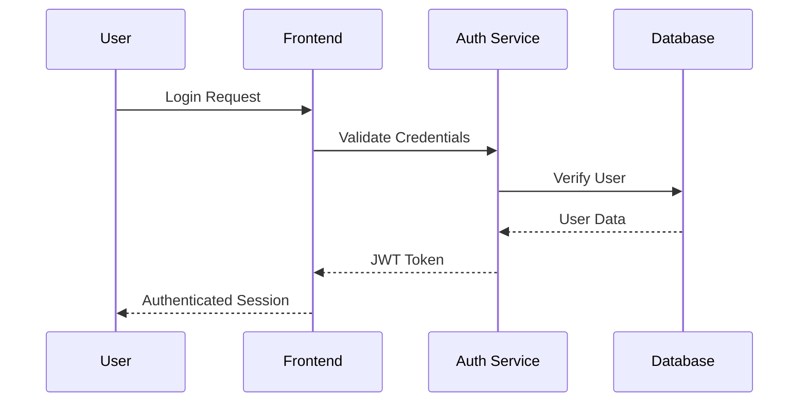

# PRD-M3: User Authentication & Profile Management

## Document Information
- **Feature ID**: M3
- **Priority**: Must Have
- **Version**: 1.0
- **Date**: September 2025
- **Owner**: Senior Business Analyst
- **Status**: Planning

---

## 1. Goal & Objectives

### Primary Goal
Establish a secure, user-friendly authentication and profile management system that enables personalized learning experiences while maintaining high security standards and compliance with privacy regulations.

### Business Objectives
- Implement secure user authentication with 99.9% uptime
- Enable personalized learning experiences and progress tracking
- Support scalable user growth to 1M+ registered users
- Ensure compliance with GDPR, CCPA, and SOC 2 standards
- Reduce user onboarding friction with <2 minute registration
- Enable social features and community engagement
- Provide foundation for premium subscription tiers

### User Objectives
- Quick and secure account creation and login
- Personalized learning dashboard and recommendations
- Seamless cross-device experience with synced progress
- Privacy control over personal information and learning data
- Social features to connect with other learners
- Easy password recovery and account management

---

## 2. Target Users & Personas

### Primary Users
- **New Learners**: First-time users creating accounts to access content
- **Returning Users**: Existing users logging in to continue learning
- **Professional Learners**: Users requiring integration with workplace systems
- **Privacy-Conscious Users**: Users with specific privacy and security requirements

### User Demographics
- **Age Range**: 22-55 years (primary: 25-40)
- **Technical Proficiency**: Moderate to high
- **Device Usage**: Multi-device (desktop, mobile, tablet)
- **Geographic Distribution**: Global with focus on US, EU, Asia-Pacific
- **Privacy Awareness**: 70% concerned about data privacy

---

## 3. Problem Statement

### Current State
Online learning platforms face significant user management challenges:
- Complex registration processes leading to 30-50% abandonment
- Weak authentication leading to security breaches
- Poor cross-device experience causing user frustration
- Limited personalization due to insufficient user data
- Privacy compliance gaps creating legal risks
- Inadequate password recovery leading to account loss

### Impact
- High user acquisition costs due to registration abandonment
- Security vulnerabilities affecting user trust
- Reduced engagement from poor personalization
- Legal risks from privacy non-compliance
- Support burden from account recovery issues
- Limited ability to implement premium features

---

## 4. Solution Overview

### Core Components
1. **Registration & Onboarding**: Streamlined account creation with email/social options
2. **Authentication System**: Secure login with multi-factor authentication
3. **User Profiles**: Comprehensive profile management with learning preferences
4. **Privacy Controls**: Granular privacy settings and data management
5. **Social Features**: User connections, profiles, and activity sharing
6. **Admin Management**: Administrative tools for user management and moderation
7. **Analytics Integration**: User behavior tracking for personalization

### Technical Architecture
- **Frontend**: React-based authentication flows with responsive design
- **Backend**: Node.js with JWT token-based authentication
- **Database**: PostgreSQL for user data with encryption at rest
- **Identity Provider**: Auth0 or AWS Cognito for enterprise-grade security
- **Session Management**: Redis for scalable session storage
- **Privacy Compliance**: Automated GDPR/CCPA compliance tools

---

## 5. User Scenarios & User Flows

### Scenario 1: New User Registration
**Context**: Software developer discovering platform through Google search, wants to access React tutorial

**User Flow**:
1. User clicks "Get Started" from landing page
2. Registration modal appears with email/password and social login options
3. User enters email and creates password (strength indicator shown)
4. Email verification sent automatically
5. User completes brief profile setup (learning goals, experience level)
6. Welcome dashboard shown with recommended content
7. Email confirmed and account activated

**Expected Behavior**:
- Registration completed in <2 minutes
- Clear password requirements and strength feedback
- Immediate access to basic content before email verification
- Personalized recommendations based on profile inputs
- Welcome email with getting started guide

### Scenario 2: Returning User Login
**Context**: Existing user returning after 1 week to continue React Hooks course

**User Flow**:
1. User visits homepage and clicks "Sign In"
2. Enters email/password or uses social login
3. Two-factor authentication prompt (if enabled)
4. Redirected to personalized dashboard
5. "Continue Learning" section shows last watched video
6. Progress indicators show course completion status

**Expected Behavior**:
- Login completed within 30 seconds
- Seamless redirect to last learning position
- Progress synced across all devices
- Personalized content recommendations updated
- Clear visual indicators of learning progress

### Scenario 3: Password Recovery
**Context**: User forgot password after not logging in for several months

**User Flow**:
1. User clicks "Forgot Password" on login page
2. Enters email address for password reset
3. Receives secure reset link within 2 minutes
4. Clicks link and creates new password
5. Automatically logged in and redirected to dashboard
6. Security notification email sent about password change

**Expected Behavior**:
- Reset link delivered quickly and reliably
- Clear instructions and secure reset process
- Automatic login after successful password reset
- Security notifications for account changes

---

## 6. Functional Requirements

### FR-1: Registration & Onboarding
- **FR-1.1**: Email-based registration with password creation
- **FR-1.2**: Social login integration (Google, LinkedIn, GitHub)
- **FR-1.3**: Email verification with automatic resend capability
- **FR-1.4**: Progressive profile completion during onboarding
- **FR-1.5**: Terms of service and privacy policy acceptance tracking
- **FR-1.6**: Welcome tutorial and platform introduction

### FR-2: Authentication & Security
- **FR-2.1**: Secure login with email/password and social options
- **FR-2.2**: Multi-factor authentication (SMS, email, authenticator app)
- **FR-2.3**: Password strength requirements and validation
- **FR-2.4**: Session management with automatic expiry
- **FR-2.5**: Device tracking and suspicious activity detection
- **FR-2.6**: Password reset with secure token-based recovery

### FR-3: User Profile Management
- **FR-3.1**: Editable user profile with personal information
- **FR-3.2**: Learning preferences and goals configuration
- **FR-3.3**: Profile picture upload and management
- **FR-3.4**: Account settings and notification preferences
- **FR-3.5**: Learning history and progress tracking
- **FR-3.6**: Achievement badges and certifications display

### FR-4: Privacy & Data Management
- **FR-4.1**: Granular privacy settings for profile visibility
- **FR-4.2**: Data export functionality for GDPR compliance
- **FR-4.3**: Account deletion with data removal options
- **FR-4.4**: Cookie consent management
- **FR-4.5**: Communication preference settings
- **FR-4.6**: Third-party data sharing controls

### FR-5: Social Features
- **FR-5.1**: Public profile pages with learning achievements
- **FR-5.2**: Follow/unfollow other learners
- **FR-5.3**: Activity feed showing learning progress
- **FR-5.4**: Direct messaging between users (optional)
- **FR-5.5**: Learning group creation and management
- **FR-5.6**: Content sharing and recommendations to connections

---

## 7. Non-Functional Requirements

### Performance Requirements
- **Login Speed**: Authentication completed within 2 seconds
- **Registration Time**: Complete registration process in <2 minutes
- **Session Loading**: User dashboard loads within 3 seconds
- **Cross-device Sync**: Profile changes synced within 5 seconds
- **Search Response**: User search results returned within 1 second

### Security Requirements
- **Authentication**: Industry-standard encryption (OAuth 2.0, JWT)
- **Password Policy**: Minimum 8 characters with complexity requirements
- **Session Security**: Secure session tokens with automatic expiry
- **Data Encryption**: All PII encrypted at rest and in transit
- **Audit Logging**: Complete audit trail of authentication events
- **Vulnerability Testing**: Regular security penetration testing

### Scalability Requirements
- **User Capacity**: Support 1M+ registered users
- **Concurrent Sessions**: Handle 50K+ simultaneous active users
- **Database Performance**: Sub-100ms query response times
- **Global Distribution**: Multi-region deployment capability
- **Auto-scaling**: Automatic resource scaling based on load

### Compliance Requirements
- **GDPR Compliance**: Full compliance with EU data protection regulations
- **CCPA Compliance**: California consumer privacy act compliance
- **SOC 2 Type II**: Security and availability compliance
- **Data Residency**: Configurable data storage location by region
- **Right to Deletion**: Complete data removal within 30 days

---

## 8. Technical Specifications

### Authentication Flow


### API Endpoints
- `POST /api/auth/register` - User registration
- `POST /api/auth/login` - User authentication
- `POST /api/auth/logout` - Session termination
- `POST /api/auth/reset-password` - Password reset request
- `GET /api/user/profile` - Get user profile
- `PUT /api/user/profile` - Update user profile
- `DELETE /api/user/account` - Delete user account

### Database Schema
```sql
Users Table:
- id (UUID, Primary Key)
- email (VARCHAR, Unique, Indexed)
- password_hash (VARCHAR)
- first_name (VARCHAR)
- last_name (VARCHAR)
- profile_picture_url (VARCHAR)
- email_verified (BOOLEAN)
- created_at (TIMESTAMP)
- last_login (TIMESTAMP)
- is_active (BOOLEAN)

User_Profiles Table:
- user_id (UUID, Foreign Key)
- learning_goals (TEXT)
- experience_level (ENUM)
- preferred_topics (JSON)
- privacy_settings (JSON)
- notification_preferences (JSON)
```

---

## 9. Success Criteria & KPIs

### Launch Criteria
- [ ] Registration process completed by 95% of users who start
- [ ] Login success rate >99% for valid credentials
- [ ] Email verification delivery rate >98%
- [ ] Profile completion rate >70% within first week
- [ ] GDPR/CCPA compliance audit passed
- [ ] Security penetration testing completed successfully

### Success Metrics

#### User Acquisition Metrics
- **Registration Completion Rate**: >95%
- **Email Verification Rate**: >85%
- **Profile Completion Rate**: >70%
- **Social Login Adoption**: >40% of new registrations

#### Authentication Metrics
- **Login Success Rate**: >99%
- **Average Login Time**: <2 seconds
- **Password Reset Success**: >95%
- **MFA Adoption Rate**: >30% of eligible users

#### Engagement Metrics
- **Profile Update Frequency**: >50% users update profile monthly
- **Cross-device Usage**: >60% users access from multiple devices
- **Social Feature Adoption**: >25% users engage with social features
- **Session Duration**: >30 minutes average

#### Security & Compliance Metrics
- **Security Incidents**: 0 major security breaches
- **Data Breach Response**: <24 hours incident response
- **Compliance Score**: 100% GDPR/CCPA compliance
- **Failed Login Attempts**: <1% of total login attempts

---

## 10. Risks & Mitigation

### Security Risks
| Risk | Impact | Probability | Mitigation |
|------|---------|------------|------------|
| Data Breach | Very High | Low | Multi-layer security, encryption, monitoring |
| Account Takeover | High | Medium | MFA implementation, suspicious activity detection |
| Password Attacks | Medium | Medium | Strong password policies, rate limiting |
| Session Hijacking | High | Low | Secure session tokens, HTTPS enforcement |

### Business Risks
| Risk | Impact | Probability | Mitigation |
|------|---------|------------|------------|
| GDPR Non-compliance | High | Low | Legal review, automated compliance tools |
| High Registration Abandonment | Medium | Medium | A/B test registration flow, reduce friction |
| User Data Loss | High | Low | Comprehensive backup strategy |
| Performance Issues | Medium | Medium | Load testing, monitoring, auto-scaling |

### Technical Risks
| Risk | Impact | Probability | Mitigation |
|------|---------|------------|------------|
| Authentication Service Downtime | High | Low | Redundant systems, failover mechanisms |
| Database Performance | Medium | Medium | Query optimization, caching, scaling |
| Third-party Integration Failure | Medium | Medium | Multiple provider options, fallback systems |

---

## 11. Dependencies & Prerequisites

### Technical Dependencies
- Identity provider setup (Auth0, AWS Cognito)
- Database infrastructure (PostgreSQL cluster)
- Email delivery service (SendGrid, AWS SES)
- CDN for global profile picture delivery
- Monitoring and logging infrastructure

### Integration Dependencies
- Video streaming system (M1) for user progress tracking
- Content management system (M4) for personalized recommendations
- Analytics platform for user behavior tracking
- Customer support system for account issues

### Compliance Dependencies
- Legal review of privacy policies and terms
- Security audit and penetration testing
- GDPR/CCPA compliance assessment
- Data protection impact assessment (DPIA)

---

## 12. Implementation Timeline

### Phase 1: Core Authentication (Weeks 1-4)
- Basic registration and login functionality
- Email verification system
- Password reset capability
- Basic profile management
- Security framework implementation

### Phase 2: Enhanced Features (Weeks 5-8)
- Multi-factor authentication
- Social login integration
- Advanced profile features
- Privacy controls implementation
- Cross-device synchronization

### Phase 3: Social & Advanced (Weeks 9-12)
- Social features development
- Advanced security features
- Performance optimization
- Compliance implementation
- Admin management tools

### Phase 4: Launch Preparation (Weeks 13-16)
- Security audit and testing
- Compliance verification
- Performance load testing
- Documentation completion
- Production deployment

---

## 13. Privacy & Compliance Framework

### GDPR Compliance Checklist
- [ ] Lawful basis for processing clearly defined
- [ ] Privacy notice provided at registration
- [ ] Consent mechanisms implemented
- [ ] Right to access functionality
- [ ] Right to rectification capabilities
- [ ] Right to erasure (right to be forgotten)
- [ ] Data portability features
- [ ] Privacy by design implementation

### Data Minimization Strategy
- Collect only necessary user information
- Implement data retention policies
- Regular data cleanup procedures
- User consent for additional data collection
- Clear data usage explanations

---

## 14. Post-Launch Operations

### Monitoring & Alerting
- Real-time authentication success/failure rates
- Security incident detection and response
- Performance metrics and SLA monitoring
- User registration and engagement tracking
- Compliance audit trail monitoring

### Continuous Improvement
- Regular security assessments and updates
- User experience optimization based on analytics
- A/B testing of registration and login flows
- Privacy policy updates for regulatory changes
- Feature enhancement based on user feedback

### Support Operations
- Account recovery assistance procedures
- Privacy request handling workflows
- Security incident response procedures
- User communication templates
- Escalation procedures for complex issues

---

*This PRD establishes the foundation for secure, compliant, and user-friendly authentication and profile management that enables all other platform features while protecting user privacy and maintaining security standards.*